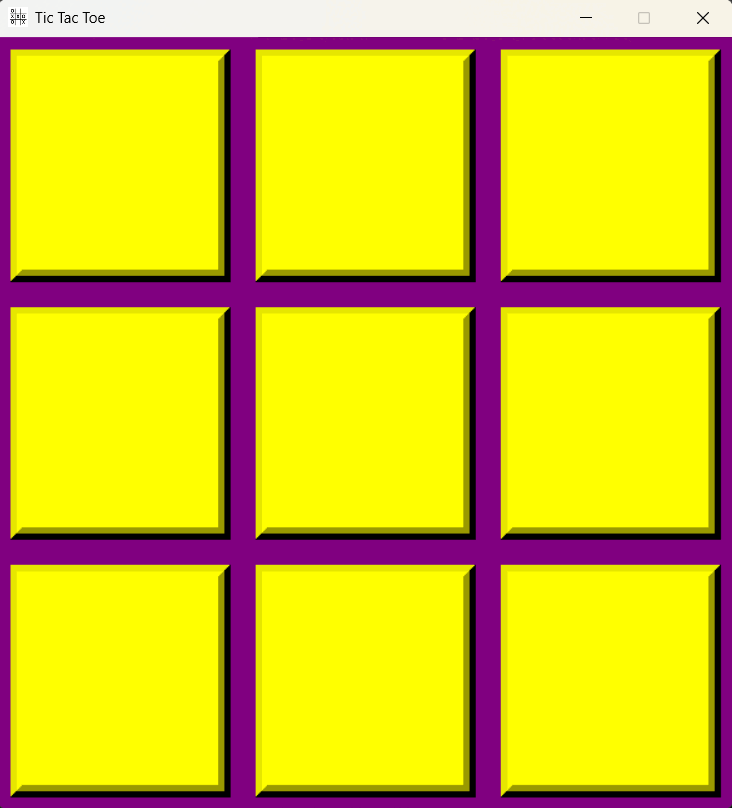

# 🎮 Tic Tac Toe – Python Tkinter GUI

A fun and interactive Tic Tac Toe game built using **Python** and the **Tkinter** GUI library. This classic 2-player game is designed with a colorful and intuitive user interface, offering a responsive and enjoyable experience.

---
## 🛠 Features

- 🎯 3x3 interactive grid using Tkinter buttons  
- 🎨 Colorful and responsive UI (Yellow buttons, purple grid background)  
- 👥 Two-player support (Player X and Player O)  
- 🏁 Win and tie detection with feedback  
- 🧼 Clean and modular code, easy to extend or refactor  

---

## 🎞️ Sample Gameplay (GIF)

  

